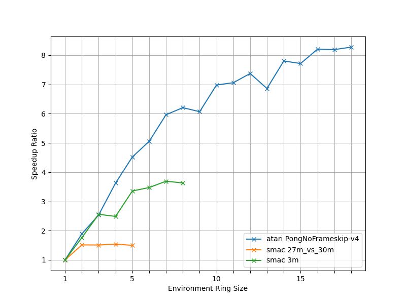
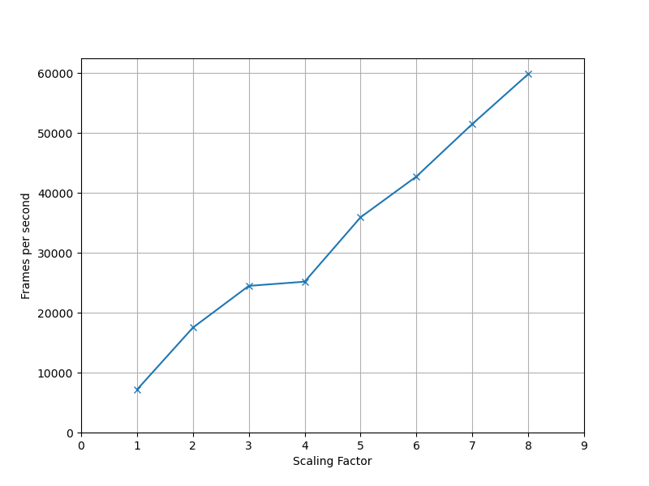
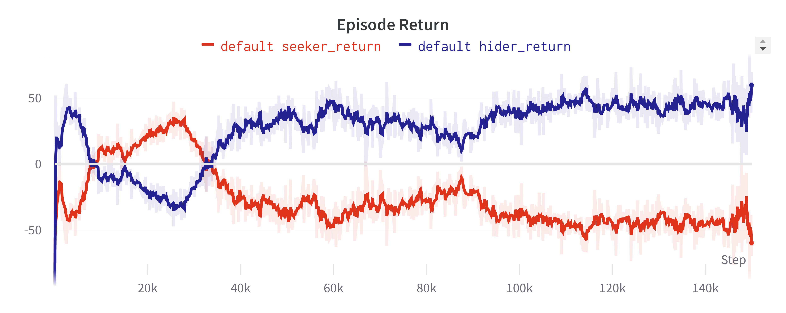
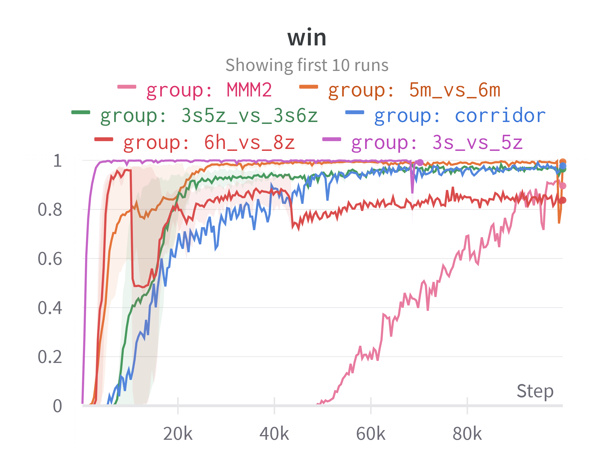

## Addtional Experiment: Env Ring Size

The environment ring is a technique used in SRL to fully utilize CPU resources of actor workers. See Section 4.2.2 in our paper for details about environment ring. Environment ring size is number of environments held in one ring. Here we present a figure that shows the relationship between environment ring size and actor worker speedup ratio in three different environments. 

  

 

From the figure, we could see that the speedup ratio increases when env ring size increases, until it reaches a plateau. The speedup is the most significant in atari PongNoFrameskip-v4. The highest speedup ratio is 8.3x when env ring size is 16. In SMAC 3m map, speedup ratio reaches at 3.7x when env ring size is 7. In SMAC 27m_vs_30m map, speedup ratio stops increasing after env ring size is larger than 2. The highest speedup ratio is around 1.5x. 

The optimal environment ring size is related to "average environment step time" and "average inference response time". "Average inference response time" is the average time between sending observations and receiving corresponding actions. Theoretically, when "average inference response time" is smaller than "average environment step time" times ring size minus one, the performance will reach its maximum value and CPU idle time for actor workers will be completely eliminated. However, in reality, there are various factors that could influence "average environment step time" and "average inference response time", and for different environments, these two metrics are usually not the same.

## Additional Experiment: MuZero Scalability 

To show the flexibility of SRL, we have implemented MuZero [1] algorithm in SRL and evaluated its scalability. MuZero is a complex model-based algorithm that contains most of the algorithmic ingredients for RL, and it could be easily implemented within SRL’s framework. Note that  there is not any distributed open-source library that has an available implementation for MuZero yet.

  

In the experiment, we implemented an extra component for the system, which is buffer worker. Buffer workers receive samples from actor workers, reanalyze them and send reanalyzed samples to trainer workers. In our experiment setup with one trainer worker, we used 1 policy worker (on 2 Nvidia 3090 GPU), 8 buffer workers (on 2 Nvidia 3090 GPU) and 1 actor worker. As number of trainers goes up, each component was scaled with a scaling factor. For example, when scaling factor is 5, we use 5 trainer workers, 5 policy workers, 40 buffer workers and 5 actor workers. The final result shows that, when running MuZero algorithm, the overall training throughput of SRL linearly scaled with the amount of computing resources used. 

Reference:
[1]Julian Schrittwieser, Ioannis Antonoglou, Thomas Hubert, Karen Simonyan, Laurent Sifre, Simon Schmitt, Arthur Guez, Edward Lockhart, Demis Hassabis, Thore Graepel, Timothy P. Lillicrap, and David Silver. 2019. Mastering Atari, Go, Chess and Shogi by Planning with a Learned Model. CoRR abs/1911.08265, (2019). Retrieved from http://arxiv.org/abs/1911.08265

## Training Curves

Following training curves show some RL agents trained by SRL. 

OpenAI Hide and Seek, trained with 960 actor workers, 32 policy workers and 4 trainer workers (1032 CPU cores, 8 Nvidia 3090 GPUs) in 68 hours:

  

  

Starcraft II, winrates on 6 different maps. Trained with 64 actor workers, 4 policy workers and 1 trainer (74 CPU cores, 2 Nvidia 3090 GPUs) in 8.8 hours:

  

## Baselines

In our paper, we have run experiments of [**RLlib**](https://docs.ray.io/en/latest/rllib/index.html) (Version 2.0.0) and [**Surreal**](https://surreal.stanford.edu/) as our baselines. Codes and configurations are shown in [baselines/](baselines/).

