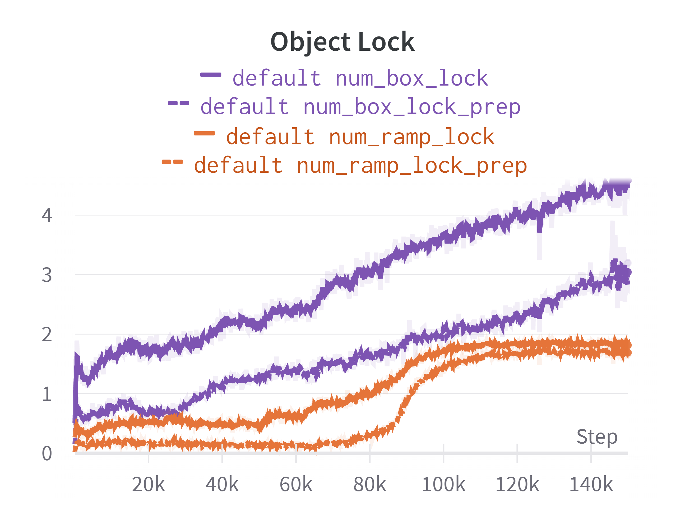

## Addtional Experiment: Env Ring Size

The environment ring is a technique used in SRL to fully utilize CPU resources of actor workers. See Section 4.2.2 in our paper for details about environment ring. Environment ring size is number of environments held in one ring. Here we present a figure that shows the relationship between environment ring size and actor worker speedup ratio in three different environments. 

  

From the figure, we could see that the speedup ratio increases when env ring size increases, until it reaches a plateau. The speedup is most significant in atari PongNoFrameskip-v4. The highest speedup ratio is 8.3x when env ring size is 16. In SMAC 3m map, speedup ratio reaches at 3.7x when env ring size is 7. In SMAC 27m_vs_30m map, speedup ratio stops increasing after env ring size is larger than 2. The highest speedup ratio is around 1.5x.

## Baselines

In our paper, we have run experiments of [**RLlib**](https://docs.ray.io/en/latest/rllib/index.html) (Version 2.0.0) and [**Surreal**](https://surreal.stanford.edu/) as our baselines. Codes and configurations are shown in [baselines/](baselines/).

## Training Curves

Following training curves show some RL agents trained by SRL. 

OpenAI Hide and Seek, number of ramps and boxes locked by the hider:

  

OpenAI Hide and Seek, episode returns for hiders and seekers:

  

Starcraft II, winrates on 6 different maps:

  

